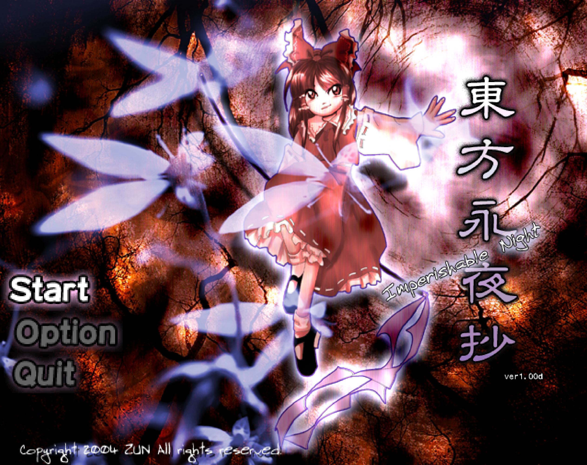

# SDL_TouHouText
一个基于 `C++` 和 `SDL2` 开发的东方风格弹幕射击游戏

## 游戏展示

  

  

## 功能特性
- 玩家移动与射击系统
- 敌人与 Boss 战斗系统
- 弹幕生成与碰撞检测
- 道具掉落系统
- 分数与最高分保存
- JSON 数据驱动关卡
- 伪 3D 背景渲染

## 技术栈
**语言** 
- `C++`

**图形与多媒体**
- `SDL2`
- `SDL_image`
- `SDL_mixer`
- `SDL_ttf`

**数据处理** 
- `nlohmann/json`

## 运行方式
- 使用 MSVC 编译
- 配置 SDL2 环境
- 编译运行项目

## 操作说明
1. **玩家移动：** 使用 `W A S D` 控制玩家移动
2. **发射弹幕：** 使用 `J` 发射弹幕
3. **Bomb：** 使用 `I` 释放 Bomb

## 技术总结
通过本项目实践：

- SDL2 游戏开发流程
- C++ 面向对象设计
- 游戏循环与状态管理
- 碰撞检测与对象管理
- JSON 数据驱动设计
- 透视投影与伪 3D 渲染